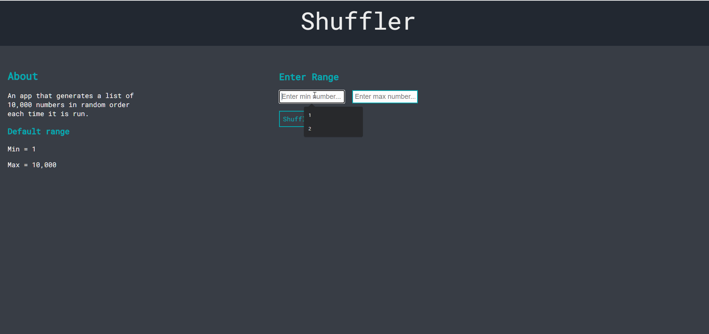
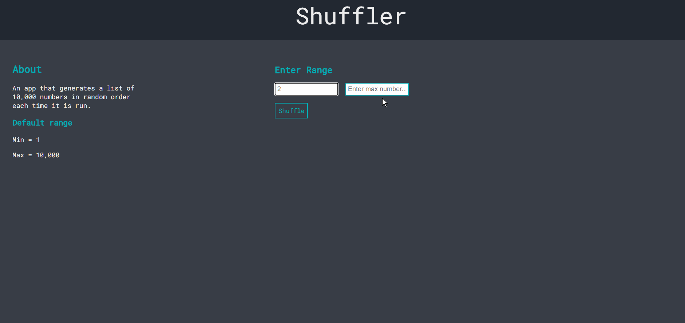
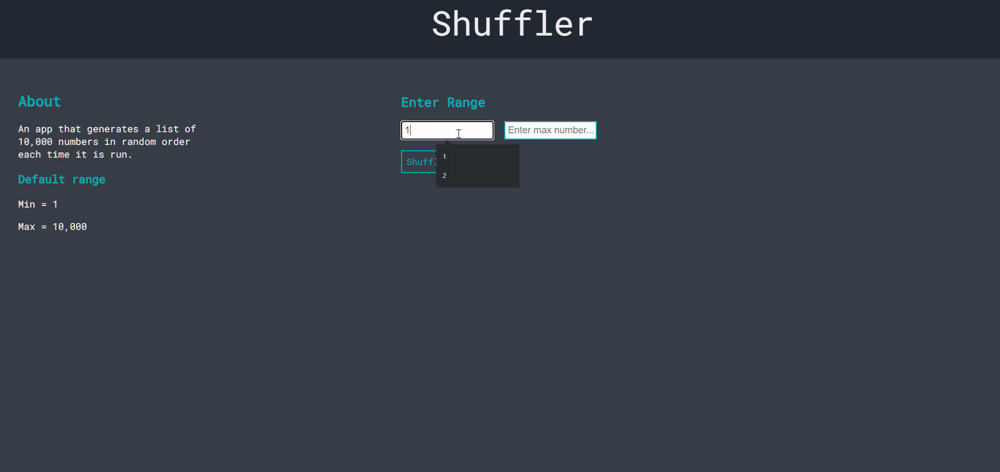

# Shuffler

**_BEWARE:_ This client was published for learning purposes. It is _not_ intended for use in production-grade software.**

## About

 An app that generates a list of 10,000 numbers in random order each time it is run. Each number in the list is unique and be between 1 and 10,000

### Application Functionality



User is able to enter min number and a max number and shuffle the numbers in random order upon clicking the button

### Extra Functionality



User is able download the result of shuffled numbers and saved in text file named as _`shuffled_numbers.txt`_.  

### Error Handles




## Getting Started

For the application to run, you will need to have NPM installed. If you do not know what NPM is, please visit this [website](https://docs.npmjs.com/about-npm).

## Setup

_Prior to installation make sure you go into the directory where you would like scheduler to reside._

**Clone** repository onto your local machine. 
```sh
1. git clone git@github.com:jayrmesa/randomNumbers.git
```

**Run** the following command in the root directory to install all dependancies.

```sh
npm i
```
## Running Webpack Development Server

**Run** the following command in the root directory
```sh
 npm start
```

1. Runs the app in the development mode.\
2. Open [http://localhost:3000](http://localhost:3000) to view it in your browser. Or will automatically open in your default browers


## Running Jest Test Framework

```sh
npm test
```

## Dependencies

- Made using **REACT** 
- jest-dom: "^5.17.0",
- react: "^13.4.0",
- web-vitals: "^2.1.4"


## Authored By
#### Arnold Mesa JayR 
